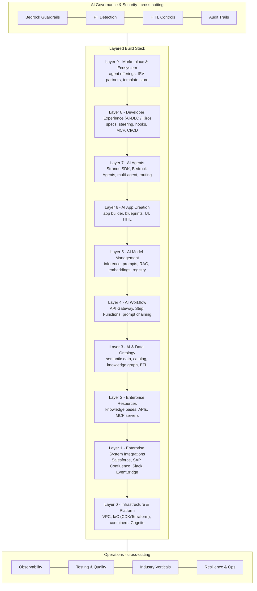

# Reference Pattern Catalog

The FDE Kit's defining feature is that it generates code from **tested, version-specific reference patterns** rather than model memory. This document catalogs those references, explains how they're organized, and describes how the agent consults them during a build.

> **Why this matters:** A general-purpose agent generates CDK, Bedrock, and agent code from training data that may be months out of date — deprecated model IDs, wrong API shapes, stale best practices. The FDE Kit's references are curated AWS patterns the agent reads *before* writing each component, so the output reflects current, verified guidance.

---

## What a Reference Is

A reference is a markdown file under `programs/ai-native-app-builder/references/` containing:

- **Purpose** — what this layer or capability covers
- **Coverage indicator** — how complete the tested-pattern coverage is
- **Capabilities** — the specific AWS services and patterns, each with authoritative AWS resource links
- **Working code** — CDK constructs, Python agents, configuration examples the agent adapts to the customer's context

References are **read-only** from the engagement's perspective — the agent consults them, then generates code into the workspace root, never back into the reference tree.

---

## How the Agent Consults References

`.fde-manifest.json` (written into the workspace during `fde_render`) is the index that tells the agent **which reference to read before writing which kind of code**:

```json
{
  "references": [
    {
      "file": "references/layer-4-ai-workflow.md",
      "skillId": "build-aws-app",
      "category": "ai-pipeline",
      "readBefore": "writing agent/model/workflow code"
    },
    {
      "file": "references/layer-6-ai-app-creation.md",
      "skillId": "build-aws-app",
      "category": "frontend",
      "readBefore": "writing UI/React code"
    }
  ]
}
```

The `readBefore` field is the contract: the agent must consult the named reference before generating that category of code. The `aws-aidlc` bridge steering reinforces this as a non-optional step during Construction.

---

## Skills That Consult References

The `ai-native-app-builder` program exposes three skills. Each consults the layer references before generating code, using `fde_get_skill(skillId=..., file="references/<layer>.md")`.

| Skill | Trigger | Purpose | Primary references consulted |
|---|---|---|---|
| Build an AWS AI-Native Application | `/build-app` | End-to-end build: infrastructure, agent, UI, deployment | All layers, driven by workload type |
| Scaffold an App Type | `/scaffold-app` | Scaffold the starting structure for a chosen app type | Layer 0, Layer 6 (app creation), Layer 7 (agents) |
| Deploy Agent to Amazon Bedrock AgentCore | `/deploy-agent` | Deploy a built agent to AgentCore Runtime | Deployment references (`deployment-agentcore-*`) |

The build skill reads references in layer order (foundation first), citing which reference it consulted for each component it generates.

---

## The Layer Methodology

References are organized into a layered architecture that maps to how an AI-native application is composed, from cloud foundation (Layer 0) up to the marketplace/ecosystem (Layer 9), with cross-cutting bands for governance, observability, testing, industry, and resilience. During a build, the agent activates only the layers relevant to the workload.

The canonical reference architecture:



Full detailed version (self-contained, open in a browser): [`architecture.html`](architecture.html)

### Layer → reference file mapping

| Canonical Layer | Reference file | Covers |
|---|---|---|
| Layer 0 — Infrastructure | `layer-0-infrastructure.md` | VPC, IaC, containers, IAM, Cognito, service discovery |
| Layer 1 — Enterprise Integrations | `layer-1-enterprise-integrations.md` | Systems of record/knowledge/activity, AgentCore Gateway, EventBridge |
| Layer 2 — Enterprise Resources | `layer-2-enterprise-resources.md` | Knowledge bases, APIs, MCP servers, structured/unstructured data |
| Layer 3 — AI & Data Ontology | `layer-3-ai-data-ontology.md` | Semantic data, catalog & lineage, knowledge graph, ETL, data quality |
| Layer 4 — AI Workflow | `layer-4-ai-workflow.md` | API Gateway, process automation, Step Functions, prompt chaining |
| Layer 5 — AI Model Management | `layer-5-ai-model-management.md` | Inference, prompt management, RAG orchestration, embeddings, registry, fine-tuning |
| Layer 6 — AI App Creation | `layer-6-ai-app-creation.md`, `layer-6-ui-design-system.md`, `layer-6-ui-implementation.md` | App builder, blueprints, UI design system + implementation, HITL |
| Layer 7 — AI Agents | `layer-7-ai-agents.md` | Strands SDK, Bedrock Agents, tools, multi-agent topology, routing |
| Layer 8 — Developer Experience | `layer-8-developer-experience.md` | Specs, steering, hooks, MCP, CI/CD automation |
| Layer 9 — Marketplace & Ecosystem | *(no reference file yet)* | Agent offerings, ISV partners, template store |

---

## Cross-Cutting References

These apply across all layers — they address concerns that span the whole application.

| Reference | Covers |
|---|---|
| `cross-deployment-guide.md` | Deployment strategy across environments |
| `cross-environment-config.md` | Environment configuration and parameterization |
| `cross-governance-security.md` | IAM policies, KMS encryption, audit trails, access control |
| `cross-industry-verticals.md` | Cross-industry considerations feeding the lens overlays |
| `cross-observability-evaluation.md` | Monitoring options (AgentCore, CloudWatch GenAI, Langfuse, etc.), evaluation frameworks, cost governance |
| `cross-resilience-operations.md` | Circuit breakers, retry/backoff, DLQ patterns, graceful degradation |
| `cross-spec-driven-methodology.md` | Spec-driven build methodology (superseded by AI-DLC when active) |
| `cross-testing-quality.md` | Testing strategy and quality gates |

---

## Deployment References (Amazon Bedrock AgentCore)

Deep-dive references for deploying agents to AgentCore Runtime.

| Reference | Covers |
|---|---|
| `deployment-agentcore-overview.md` | Decision guide: CLI vs Starter Toolkit, deployment modes, production gotchas, troubleshooting, security checklist |
| `deployment-agentcore-cli.md` | `agentcore create / dev / deploy / invoke` workflow, framework selection, hot reload |
| `deployment-agentcore-services.md` | Full AgentCore service inventory (Runtime, Memory, Gateway, Code Interpreter, Browser, Observability, Evaluation, Identity, Policy) with selection criteria |
| `deployment-agentcore-starter-toolkit.md` | Python `bedrock-agentcore-starter-toolkit` walkthrough, IaC generation (CDK/Terraform), local testing |

---

## Industry References (Worked Example)

A complete worked example — insurance claims processing — showing how the layers compose for a real vertical. These serve as an end-to-end illustration the agent can adapt.

| Reference | Covers |
|---|---|
| `industry-insurance-claims-overview.md` | Business context and requirements for the worked example |
| `industry-insurance-claims-architecture.md` | End-to-end architecture composed from the layers |
| `industry-insurance-claims-strands.md` | Strands Agents implementation for the claims workflow |
| `industry-insurance-claims-samples.md` | Sample code and configurations |

---

## Reference Count by Category

| Category | Count |
|---|---|
| Layer references | 11 |
| Cross-cutting references | 8 |
| Deployment references | 4 |
| Industry worked-example references | 4 |
| **Total** | **27** |

The "tested reference patterns" headline count refers to the reusable architecture and deployment patterns (layer + cross-cutting + deployment references, plus the industry worked example) that the agent consults during a build. The exact file count evolves as patterns are added or split; this catalog is the source of truth for what ships in the current release.

---

## Keeping References Current

References are versioned with the kit. When AWS ships a new service, deprecates a model ID, or publishes a new pattern, the corresponding reference file is updated — and every engagement after that inherits the change automatically. This is why the kit is MIT-0: you can fork it, add your own tested patterns, and the consultation mechanism works identically with your patterns.

To add or update a reference:
1. Edit or add the file under `programs/ai-native-app-builder/references/`
2. Register it in `program.yaml`'s `references:` list so `.fde-manifest.json` picks it up with a `readBefore` trigger
3. The next `fde_render` makes it available to the agent
